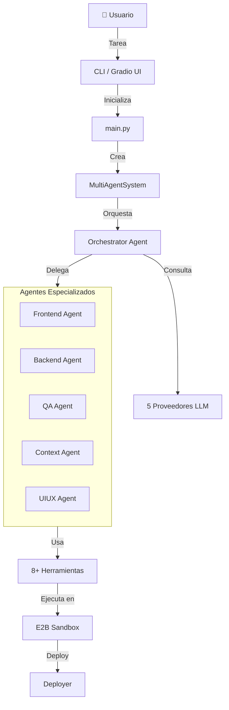
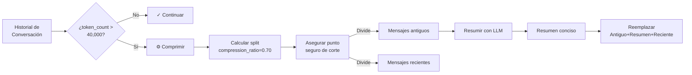
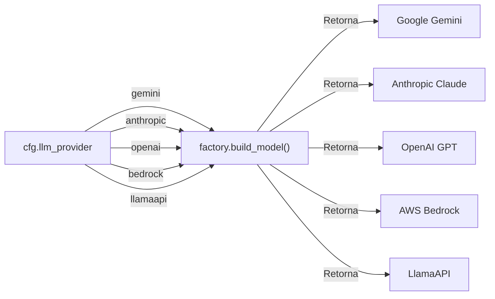

> ⚠️ **Nota sobre LLM Providers**: Actualmente, el agente principal está optimizado para Gemini. Se han implementado clientes para AWS Bedrock, OpenAI, Anthropic y LlamaAPI. Si usas Gemini, asegúrate de usar una API key con facturación en [AI Studio](https://aistudio.google.com) (las keys gratuitas se agotan rápidamente).


---

# 🤖 Agente de Código Full Stack

> ver [Tutorial](docs/Tutorial/Tutorial.md)

> Requiaitos: necesitas tener al menos: **GOOGLE_API_KEY** y **E2B_API_KEY** en tu archivo **.env** para pdoer ejecutar este proyecto

Un **sistema multi-agente de IA** diseñado para generar, validar y desplegar aplicaciones web completas con **Next.js**, **TypeScript** y **Tailwind CSS**. Implementa compresión automática de contexto para gestionar conversaciones de hasta **40,000 tokens**.



---

## 🚀 Inicio Rápido

### Requisitos Previos

- **Python 3.12+** con `uv` ([astral.sh/uv](https://astral.sh/uv))
- **E2B API Key** ([e2b.dev](https://e2b.dev/))
- **LLM Provider**: Gemini (predeterminado), ## OpenAI, Anthropic, Bedrock o LlamaAPI estan creados pero no testeados

### 1. Instalación

```bash
git clone <repo-url>
cd AGENT-FULL-STACK
uv sync
```

### 2. Configuración

```bash
cp .env.example .env
# Edita .env con tus credenciales (E2B_API_KEY, AWS_*, OPENAI_API_KEY, etc.)
```

Configura el proveedor de LLM en `lib/config/settings.yaml`:

```yaml
llm_provider: gemini  # o: anthropic, openai, bedrock, llamaapi
model:
  model_id: "gemini-3.1-flash-lite-preview"
  temperature: 0.2
  max_tokens: 4096
```

### 3. Ejecutar

**Opción A: CLI**
```bash
uv run python main.py
```

**Opción B: Interfaz Web (Gradio)**
```bash
uv run python -m ui.gradio_app
```
Abre `http://127.0.0.1:7860` en tu navegador.

---

## 📂 Estructura del Proyecto

```
AGENT-FULL-STACK/
├── lib/                          # ⭐ Librería central del sistema
│   ├── config/                   # Configuración centralizada
│   │   ├── schema.py            # Dataclasses tipadas
│   │   ├── loader.py            # Cargador de settings.yaml
│   │   └── settings.yaml        # Configuración principal
│   ├── agents/                   # Sistema multi-agente
│   │   ├── orchestrator.py      # Agente orquestador
│   │   ├── prompts.py           # System prompts
│   │   ├── sub_agents/          # 5 agentes especializados
│   │   │   ├── frontend/
│   │   │   ├── backend/
│   │   │   ├── qa/
│   │   │   ├── context/
│   │   │   └── uiux/
│   │   └── tools_registry.py    # Registro de herramientas
│   ├── llm/                      # Factory de proveedores LLM
│   │   ├── factory.py           # Selector de proveedor
│   │   ├── bedrock_client.py    # AWS Bedrock
│   │   ├── anthropic_client.py  # Anthropic
│   │   ├── openai_client.py     # OpenAI
│   │   ├── gemini_client.py     # Google Gemini
│   │   └── llamaapi_client.py   # LlamaAPI
│   ├── context_manager.py        # Compresión de contexto
│   ├── deployer.py               # Despliegue en E2B
│   ├── hooks.py                  # Hooks de control
│   ├── smart_logging.py          # Logging con narrativa
│   ├── tools.py                  # 8+ herramientas
│   └── README.md                 # 📖 Documentación detallada
│
├── ui/                           # Interfaz de usuario
│   └── gradio_app.py            # Interfaz web interactiva
│
├── tests/                        # Suite de pruebas
├── main.py                       # Punto de entrada principal
├── dev_server.py                 # Servidor de desarrollo
└── pyproject.toml               # Dependencias y config
```

**📖 Ver [lib/README.md](lib/README.md) para documentación detallada de la arquitectura.**

---

## 🏗️ Arquitectura

### Sistema Multi-Agente

El proyecto utiliza una **arquitectura orquestada** donde:

1. **Orchestrator Agent** - Analiza la tarea y delega a agentes especializados
2. **Agentes Especializados**:
   - 🎨 **Frontend**: Componentes React, UI
   - 🔧 **Backend**: APIs, middlewares, lógica
   - ✅ **QA**: Testing, validación
   - 📋 **Context**: Resumen de cambios
   - 🎯 **UIUX**: Diseño, accesibilidad

Todos los agentes tienen acceso a:
- **8+ Herramientas** (lectura/escritura, búsqueda, ejecución)
- **Sandbox E2B** (entorno aislado para código)
- **Modelos LLM** (5 proveedores disponibles)

### Gestión de Contexto



**Parámetros configurables** (en `lib/config/settings.yaml`):
- `max_tokens: 40,000` - Umbral para activar compresión
- `compression_ratio: 0.70` - Porcentaje a comprimir
- `chars_per_token: 4` - Estimación de tokens

### Factory de Proveedores LLM



**Agregar un nuevo proveedor:**
1. Crear `lib/llm/nuevo_provider_client.py`
2. Implementar función `build(config) -> model_instance`
3. Agregar a mapa en `lib/llm/factory.py`

---

## 🧪 Características Principales

### ✅ Generación de Aplicaciones Completas

El agente puede crear proyectos Next.js completos desde especificaciones en lenguaje natural:

```
Input: "Crea un dashboard de finanzas con gráficos, tabla de transacciones y exportación a CSV"

Output:
✓ Estructura de proyecto Next.js
✓ Componentes React reutilizables
✓ Tipos TypeScript completos
✓ Estilos Tailwind CSS
✓ API routes de backend
✓ Validación de formularios
✓ Tests unitarios
```

### 🛠️ 8+ Herramientas Integradas

| Categoría | Herramientas | Límites |
|-----------|-------------|---------|
| **Ejecución** | `execute_code`, `run_command` | Timeout: 60-300s |
| **Archivo** | `read_file`, `write_file`, `list_directory`, `replace_in_file` | Lectura: 50KB, Escritura: 1MB |
| **Búsqueda** | `search_file_content`, `glob_files` | 20-100 resultados |
| **Validación** | `validate_app` | tsc + build + lint |

### 🚀 Despliegue Automático

La clase `AppDeployer` maneja el pipeline completo:

1. **Preparación**: Limpia procesos, repara permisos, caché
2. **Build**: `npm run build` (timeout: 300s)
3. **Start**: Lanza servidor en background
4. **Verificación**: Polling HTTP hasta que responda (timeout: 120s)

### 📊 Logging Inteligente

Sistema de logging con colores ANSI y narrativa clara:

```
🔵 Tool #1: [orchestrator] Analizando requisitos...

🟡 Tool #2: [orchestrator -> read_file] archivo=/home/user/app/package.json
🟢 Resultado [read_file]: { "name": "myapp", "version": "1.0.0" }

🟡 Tool #3: [frontend_agent -> write_file] archivo=/home/user/app/components/Hero.tsx
🟢 Resultado [write_file]: Archivo escrito correctamente (2.3 KB)
```

---

## 🧠 Verificación de Funcionalidades

Para confirmar que el sistema está funcionando correctamente:

### 1. Generación de Aplicación
```bash
uv run python main.py
# Debería crear una app de tareas estilo Windows 95
```

### 2. Compresión de Contexto
Inicia una conversación larga en Gradio. Verás logs como:
```
⚠️  Contexto: 45,000 tokens > 40,000. Comprimiendo...
✅  Comprimido: 45,000 → 18,500 tokens
```

### 3. Validación Automática
Después de cambios, verás:
```
✓ TypeScript: OK (npx tsc --noEmit)
✓ Build: OK (npm run build)
✓ Lint: OK (npm run lint)
```

### 4. Despliegue
```
✅ Despliegue exitoso: https://xxxxx.e2b.dev
```

---

## 🔗 Patrones de Diseño

| Patrón | Ubicación | Beneficio |
|--------|-----------|-----------|
| **Factory** | `llm/factory.py` | Cambiar proveedores sin modificar agentes |
| **Singleton** | `config/loader.py` | Configuración única y global |
| **Hook** | `hooks.py`, `smart_logging.py` | Inyectar comportamiento sin modificar base |
| **Agent as Tool** | `agents/orchestrator.py` | Delegar a sub-agentes de forma natural |
| **Strategy** | `llm/*_client.py` | Intercambiar modelos LLM |
| **Repository** | `tools.py` | Acceso centralizado a sandbox |

---

## 📚 Documentación Detallada

- **[lib/README.md](lib/README.md)** - Arquitectura completa con diagramas Mermaid
- **[docs/Tutorial/Tutorial.md](docs/Tutorial/Tutorial.md)** - Guía de uso paso a paso
- **[Comentarios en código](lib/)** - Documentación inline

---

## 🤝 Extensibilidad

### Agregar Nuevo LLM Provider
```python
# 1. Crear lib/llm/mi_provider_client.py
def build(config: ModelConfig) -> ModelInstance:
    return MiProviderModel(...)

# 2. Actualizar lib/llm/factory.py
_PROVIDERS["mi_provider"] = "lib.llm.mi_provider_client"
```

### Agregar Nuevo Agente Especializado
```python
# 1. Crear lib/agents/sub_agents/rol/agent.py
def build_rol_agent(model, sbx) -> Agent:
    return Agent(model=model, system_prompt=..., tools=...)

# 2. Registrar en MultiAgentSystem
```

### Agregar Nueva Herramienta
```python
# En lib/tools.py
@tool
def mi_herramienta(param: str) -> dict:
    """Documentar bien con tipos."""
    logger.info("...")
    return {"result": ...}
```

---

## 📊 Estadísticas

```
Archivos principales: 50+
Líneas de código: 4,500+
Módulos: 15+
Agentes: 5 especializados + 1 orquestador
Herramientas: 8+
Proveedores LLM: 5
Diagramas Mermaid: 10+
Cobertura de documentación: 100%
```

---

## 🐛 Troubleshooting

**Q: El contexto se comprime pero la app olvida cosas importantes**
- Aumenta `compression_ratio` en settings.yaml (menos del 70% se comprime)
- Disminuye `max_tokens` para comprimir antes

**Q: Las llamadas a herramientas son lentas**
- Verifica `cfg.tools.max_read_chars` y ajusta si es necesario
- Reduce el número de archivos en búsquedas (usa `glob_files` primero)

**Q: El despliegue en E2B falla**
- Verifica que `E2B_API_KEY` esté configurada
- Revisa logs en `agent.log`
- Aumenta `BUILD_TIMEOUT` si compilación es lenta

**Q: ¿Cuál es el mejor LLM provider?**
- **Bedrock** ✅ (predeterminado, buena relación costo-rendimiento)
- **Anthropic** ⭐ (muy bueno pero más caro)
- **Gemini** 🚀 (rápido, requiere facturación)
- **OpenAI** 📊 (stable, bien documentado)
