# Tutorial para probar el sistema multiagente

> **Nota:** Por el momento, el proyecto solo ha sido probado con **Gemini de Google**, aunque ya existen configuraciones para otros proveedores dentro del directorio [`lib/llm`](lib/llm).

## 1. Iniciar la aplicación

Desde la carpeta raíz del proyecto, ejecuta el siguiente comando:

```bash
uv run python -m ui.gradio_app
```

Espera unos segundos a que se levante la instancia. Luego abre en tu navegador:

- http://127.0.0.1:7860

## 2. Interfaz inicial

Al abrir la aplicación, verás una pantalla como esta:

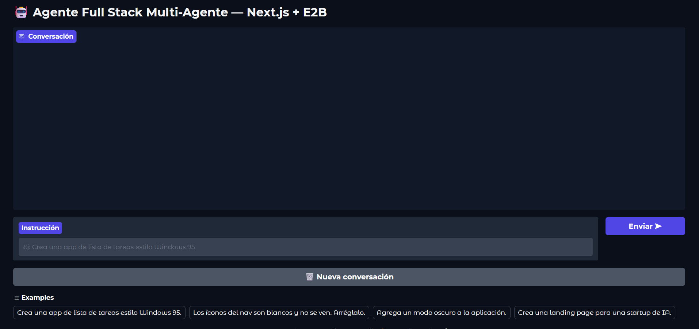

## 3. Primera instrucción al agente

Puedes comenzar dándole una instrucción sencilla, por ejemplo:

> "Créame una app básica que permita al usuario escribir dos números, tener un botón que los sume y mostrar el resultado."

> **Sugerencia:** También puedes hacer solicitudes más complejas, aunque eso consumirá más tokens.

## 4. Ejecución del agente

Una vez enviada la instrucción, el agente comenzará a trabajar:

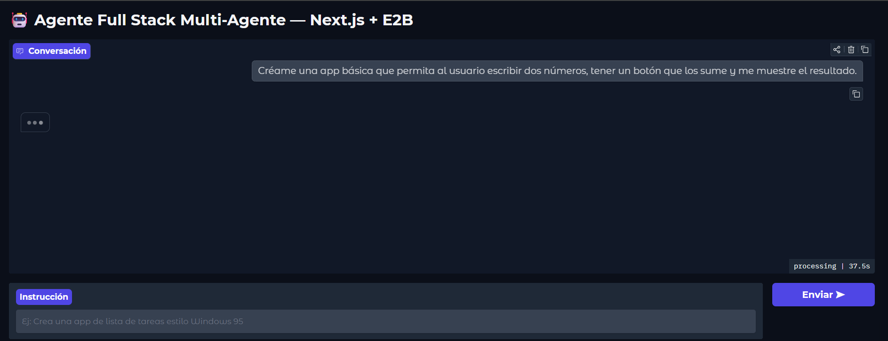

Mientras tanto, en la consola podrás ver el detalle de las acciones que va realizando:

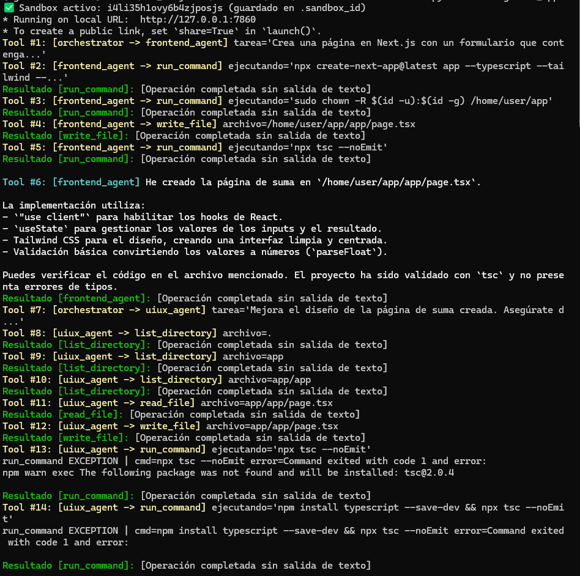

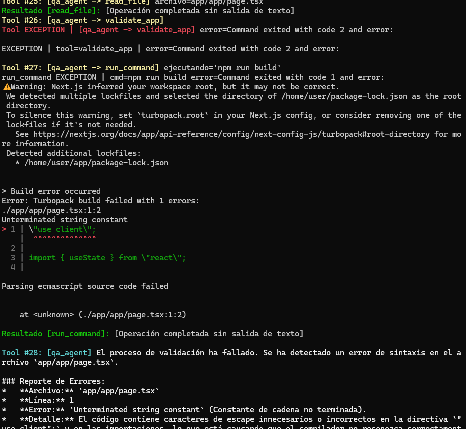

## 5. Resultado generado

Cuando termine, el sistema mostrará el resultado:

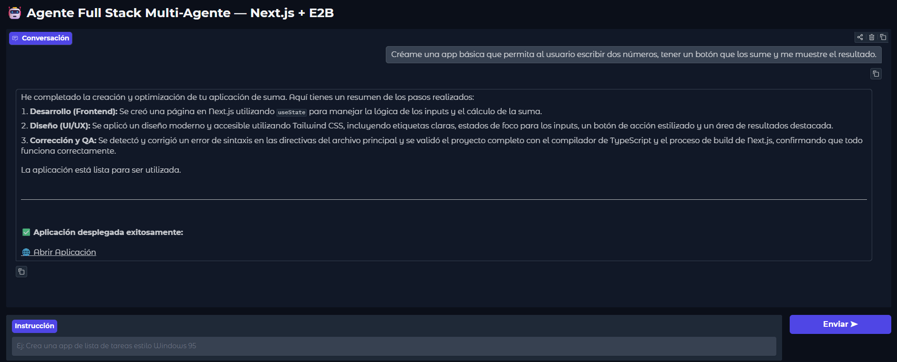

Además, proporcionará un enlace desde el cual podrás acceder a la versión en vivo de la aplicación generada:

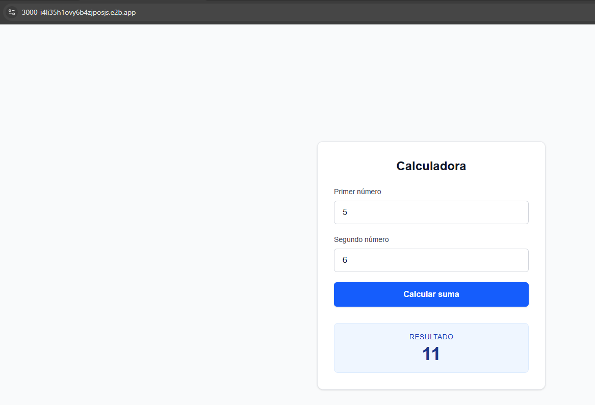

## 6. Hacer mejoras sobre la app

Ahora puedes pedirle una mejora, por ejemplo:

> "Agrega un botón que permita multiplicar esos números, además del botón de suma."

El agente volverá a ejecutar el proceso, y nuevamente podrás ver su progreso en la consola:

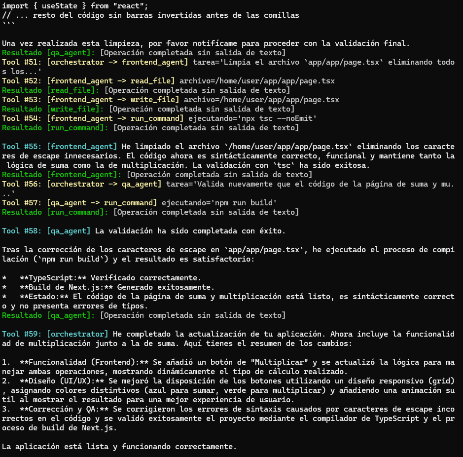

Después te mostrará otra vez la versión en vivo actualizada:

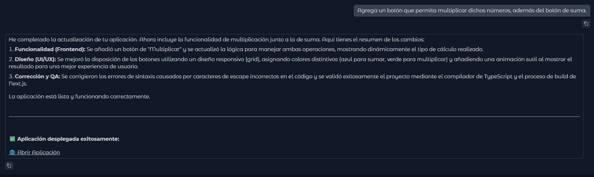

Al hacer clic en el enlace, podrás ver la aplicación funcionando:

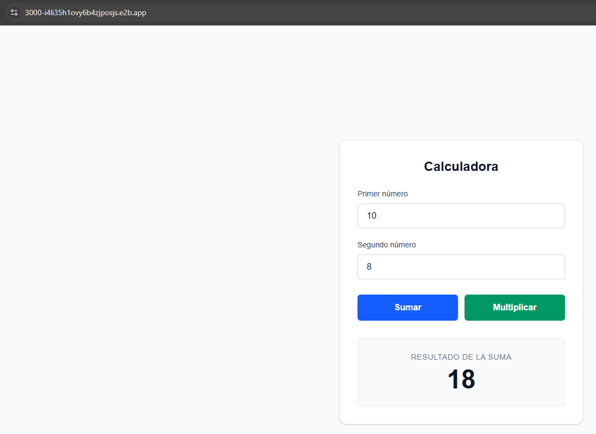

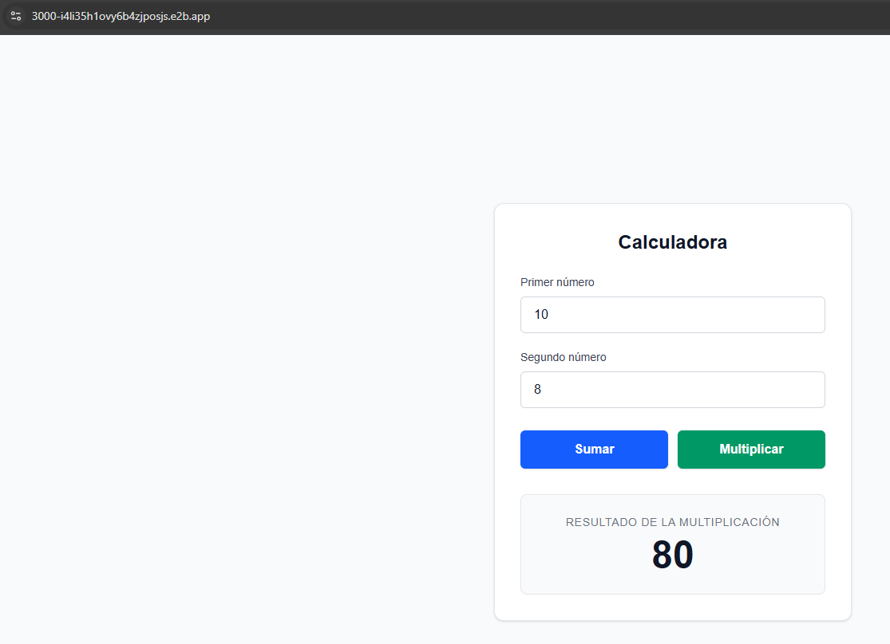

## 7. Agregar más funcionalidades

También puedes seguir ampliando la aplicación con instrucciones como esta:

> "Añade un botón para restar y otro para dividir, considerando los casos en los que la división no sea posible."

El agente procesará la nueva solicitud:

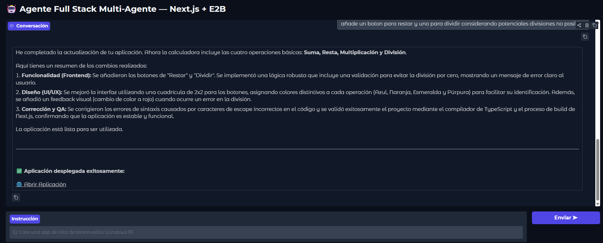

Y podrás acceder otra vez a la versión en vivo de la página:

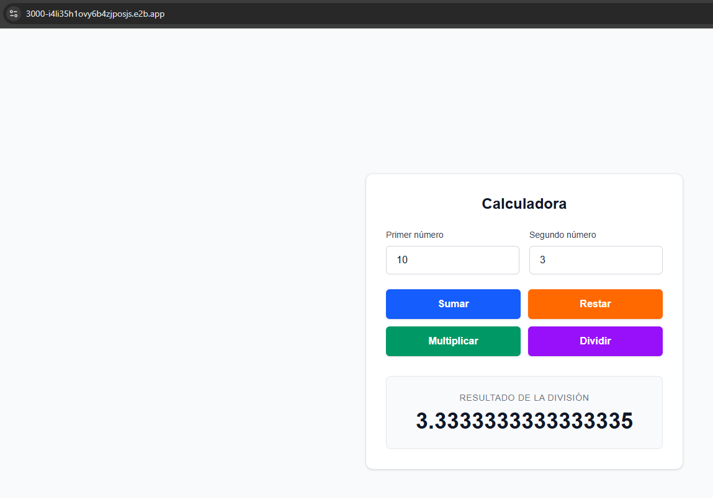

## 8. Registro de ejecución

Si quieres revisar el historial de mensajes mostrados en consola durante este tutorial, puedes consultarlo en:

[`docs/Tutorial/log.txt`](docs/Tutorial/log.txt)