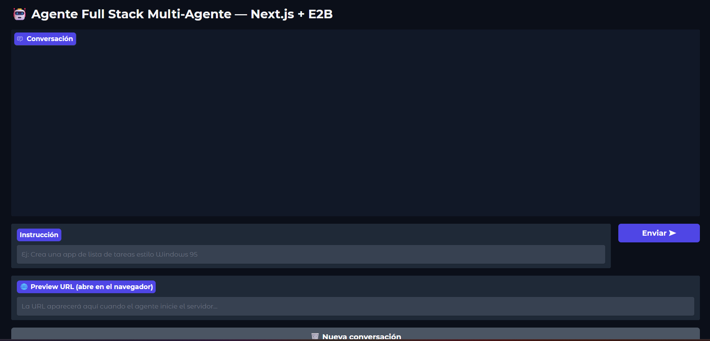
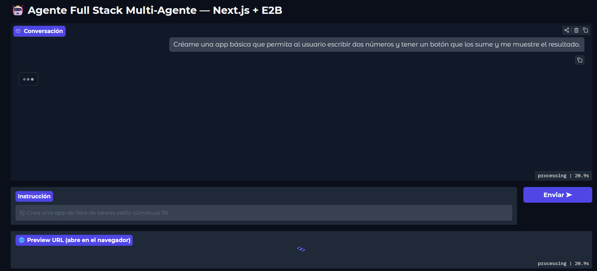
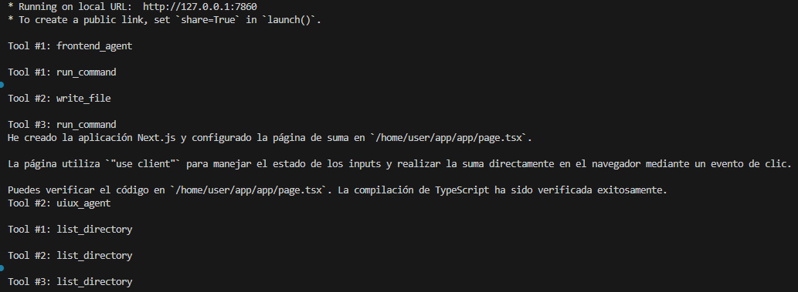
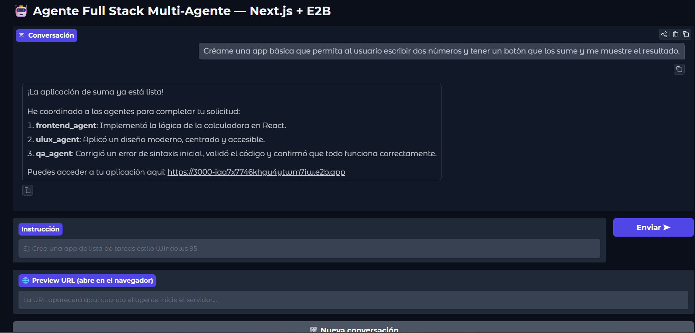
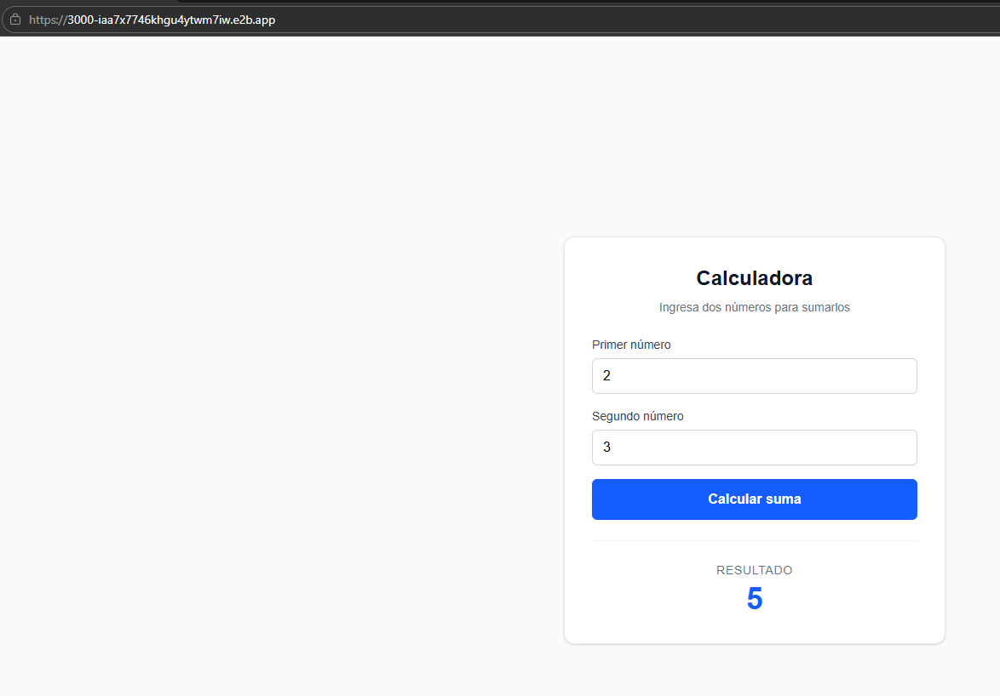
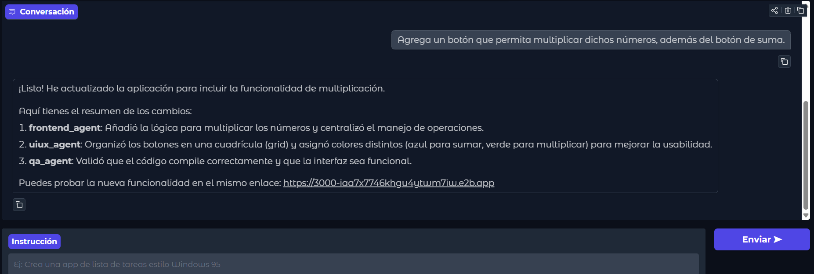

 inciamos el agente con este omando: uv run python -m ui.gradio_app     

 esperamos que levante la isntancia y vamos a  http://127.0.0.1:7860

 veremos esta imagen:

 

Dale una isntruccion basica como "“Créame una app básica que permita al usuario escribir dos números y tener un botón que los sume y me muestre el resultado.”" (puede ser un puedido mas complejo, pero hgastara mas tokens)

El agente empezara a trabajr

En cosnola se podra ver que esta haciendo el agente:

y dara el resultado:

en elenalce que da se peude acceder a la version en vivo de la app:

ahroa pdoemos pedirle, por ejemplo "Agrega un botón que permita multiplicar dichos números, además del botón de suma."

y me muestra la version en vivo nuevamente

