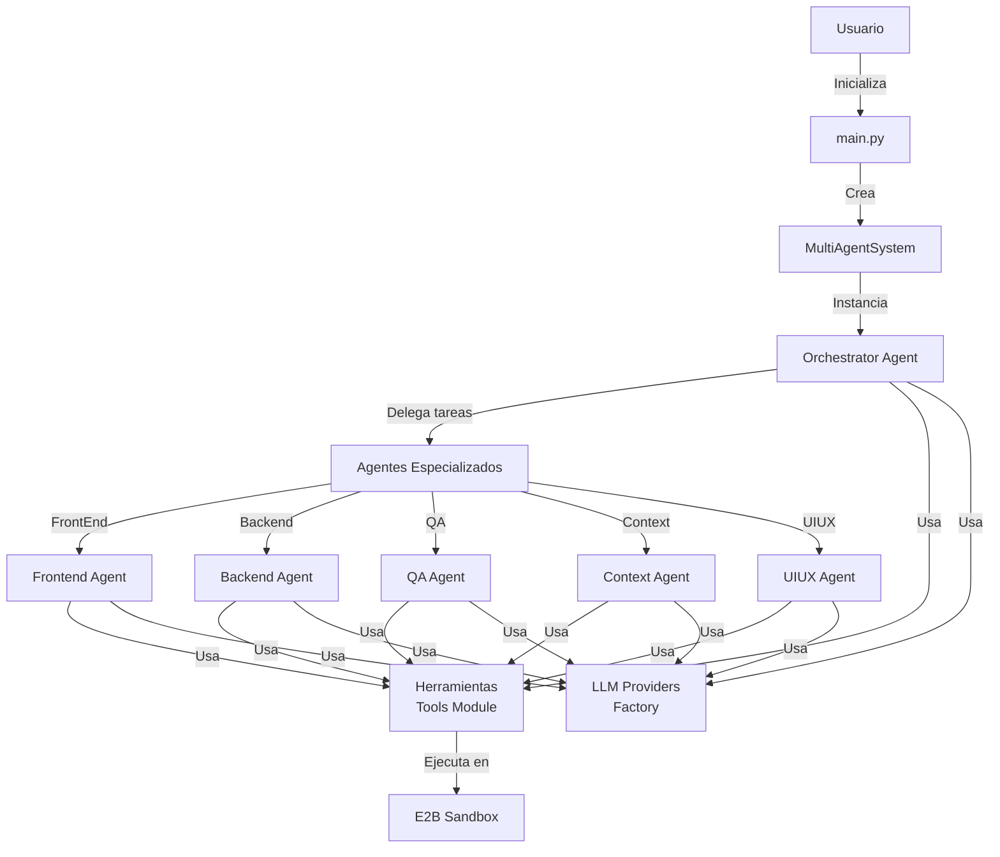
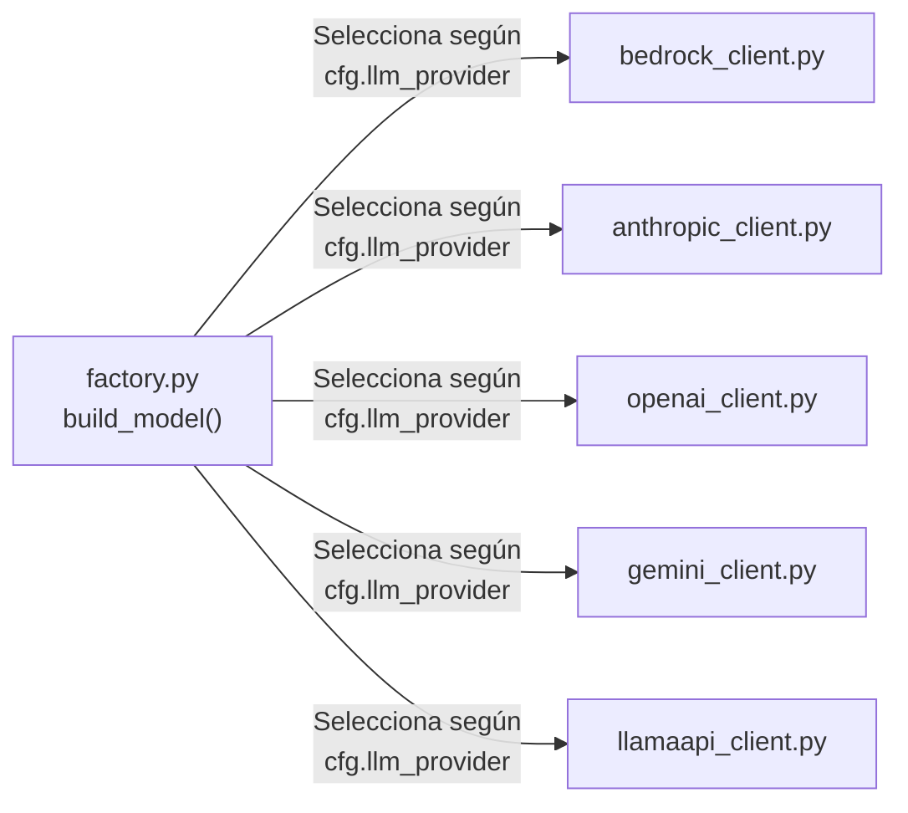
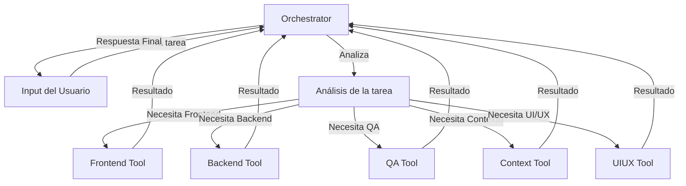
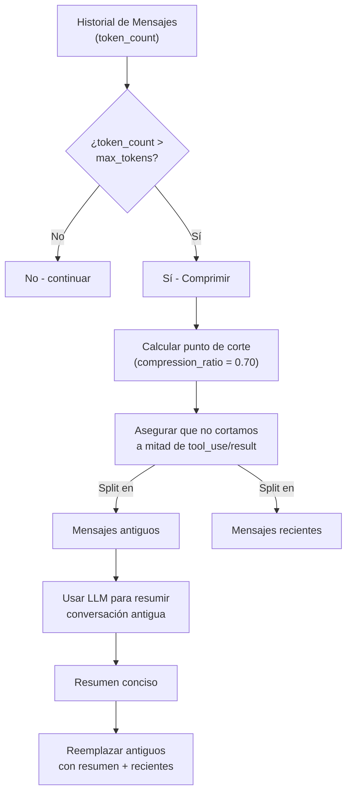
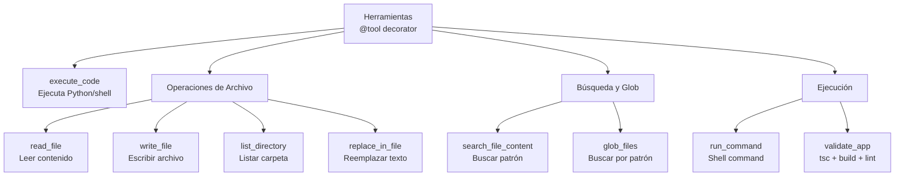
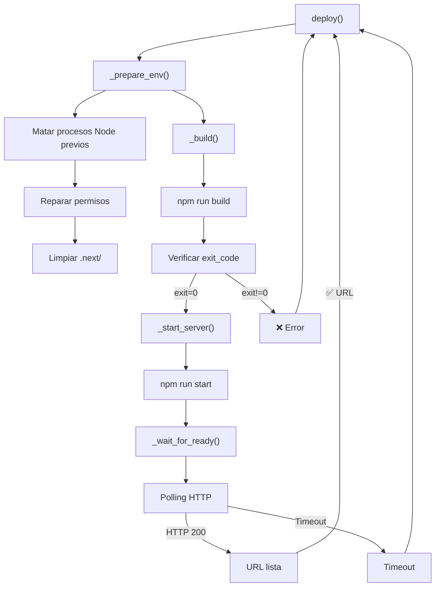
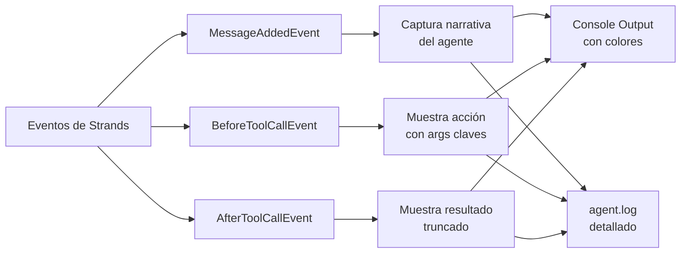
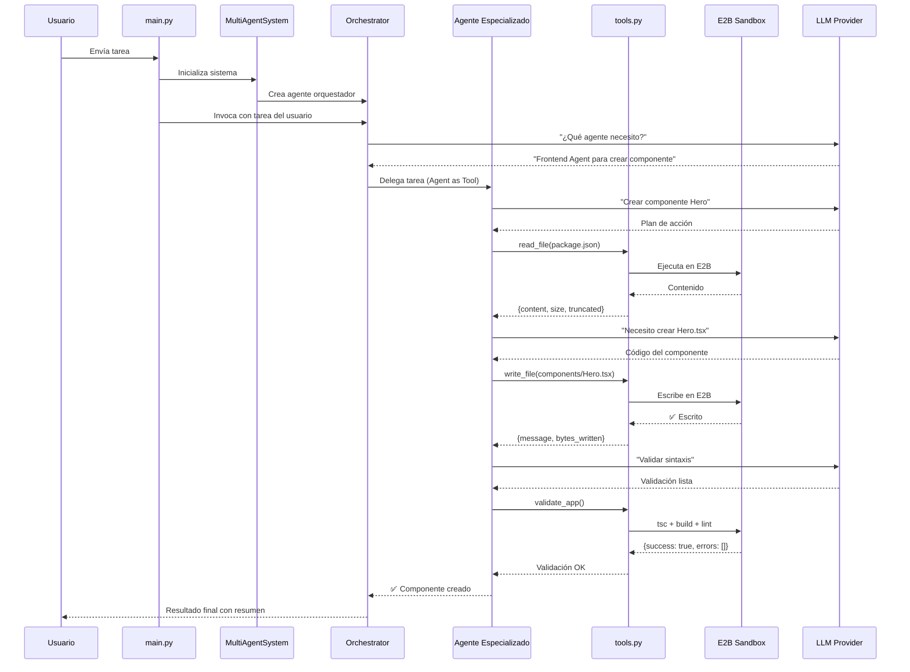

# Librería `lib/` - Sistema Multi-Agente

Este directorio contiene los módulos centrales del sistema multi-agente de IA. La arquitectura está diseñada para orquestar múltiples agentes especializados que colaboran en el desarrollo y despliegue de aplicaciones Next.js.

---

## 📋 Estructura General

```
lib/
├── config/                    # Configuración centralizada
├── agents/                    # Orquestación y agentes especializados
├── llm/                       # Factory y clientes de proveedores LLM
├── context_manager.py         # Compresión de contexto conversacional
├── deployer.py                # Despliegue automático en sandbox E2B
├── hooks.py                   # Hooks de control del agente
├── smart_logging.py           # Logging mejorado con narrativa
├── tools.py                   # Herramientas disponibles para agentes
└── __init__.py
```

---

## 🏗️ Arquitectura de Alto Nivel



---

## 📦 Módulos Principales

### 1. **`config/`** - Configuración Centralizada

**Archivos:**
- `schema.py` - Define dataclasses tipadas para toda la configuración
- `loader.py` - Carga la configuración desde `settings.yaml`
- `settings.yaml` - Archivo de configuración en YAML

**Responsabilidades:**
- Centralizar todos los parámetros (timeouts, límites, modelo LLM, etc.)
- Garantizar tipado estático en Python
- Permitir sobrescribir valores desde variables de entorno

**Dataclasses principales:**
```python
ModelConfig       # Parámetros del modelo (temperature, max_tokens, etc.)
AgentConfig       # Límites de llamadas a herramientas
ContextConfig     # Compresión de contexto (max_tokens, compression_ratio)
SandboxConfig     # Timeout del sandbox
ToolsConfig       # Límites de lectura/escritura, skip_dirs
GradioConfig      # Interfaz web
```

---

### 2. **`llm/`** - Factory de Modelos LLM

**Patrón: Factory Pattern**
> Por el momento el sistema solo funciona con GEMINI



**Archivos:**
- `factory.py` - Factory function que elige el proveedor correcto
- `bedrock_client.py` - Cliente AWS Bedrock
- `anthropic_client.py` - Cliente Anthropic/Claude
- `openai_client.py` - Cliente OpenAI
- `gemini_client.py` - Cliente Google Gemini
- `llamaapi_client.py` - Cliente LlamaAPI

**Ventajas:**
- ✅ Agregar un nuevo proveedor solo requiere un nuevo `*_client.py`
- ✅ Cambiar de proveedor sin tocar el código de agentes
- ✅ Las dependencias opcionales se cargan solo cuando se necesitan

---

### 3. **`agents/`** - Sistema Multi-Agente

#### **Orchestrator (`orchestrator.py`)**

El agente central que coordina todo el trabajo. No implementa código directamente, sino que delega tareas a agentes especializados usando el patrón **"Agent as Tool"** de Strands.



**Características:**
- ✅ Hooks para limitar llamadas a herramientas (`MaxToolCallsHook`)
- ✅ Compresión automática del contexto cuando supera límite
- ✅ Logging mejorado con `SmartLoggingHook`

#### **Agentes Especializados** (`sub_agents/`)

Cada agente tiene un rol específico:

```
sub_agents/
├── frontend/      # Componentes React, Next.js, UI
├── backend/       # APIs, middlewares, lógica del servidor
├── qa/            # Testing, validación, verificación
├── context/       # Manejo de contexto, resumen de cambios
├── uiux/          # Diseño UX, accesibilidad
```

**Patrón compartido en todos:**
```python
def build_<role>_agent(model, sbx) -> Agent:
    """Construye el agente especializado con:
    - System prompt específico del rol
    - Herramientas disponibles
    - Hooks de logging
    """
```

---

### 4. **`context_manager.py`** - Compresión de Contexto

**Problema:** El historial de conversación crece indefinidamente → tokens agotados.

**Solución:** Resumir automáticamente el 70% más antiguo del historial cuando supera el límite.



**Funciones principales:**
- `count_tokens(messages)` - Estima tokens usando `chars_per_token`
- `compress_context(messages, model)` - Comprime historial antigua
- `maybe_compress(agent, model)` - Llamada automática después de cada respuesta

**Parámetros (desde `cfg.context`):**
- `max_tokens: 40,000` - Umbral para activar compresión
- `compression_ratio: 0.70` - Porcentaje a comprimir
- `chars_per_token: 4` - Estimación de tokens

---

### 5. **`tools.py`** - Herramientas Disponibles para Agentes

Las herramientas están marcadas con el decorador `@tool` de Strands. Ejecutan en el sandbox E2B.



**Categorías:**

| Categoría | Herramientas | Uso |
|-----------|-------------|-----|
| **Ejecución** | `execute_code` | Ejecutar Python, instalar npm, etc. |
| **Archivo** | `read_file`, `write_file`, `list_directory`, `replace_in_file` | Manipulación de archivos |
| **Búsqueda** | `search_file_content`, `glob_files` | Encontrar código y patrones |
| **Comandos** | `run_command`, `validate_app` | Shell commands, compilación |

**Límites (desde `cfg.tools`):**
- `max_read_chars: 50,000` - Máximo por lectura
- `max_write_chars: 1,000,000` - Máximo por escritura
- `search_max_results: 20` - Resultados de búsqueda
- `glob_max_results: 100` - Resultados de glob
- `skip_dirs: [node_modules, .next, .git, __pycache__]` - Directorios ignorados

---

### 6. **`deployer.py`** - Despliegue Automático

**Clase:** `AppDeployer` - Automatiza la compilación y despliegue de Next.js en E2B.



**Flujo:**
1. **Preparación:** Mata procesos antiguos, repara permisos, limpia caché
2. **Build:** Ejecuta `npm run build` con timeout de 300s
3. **Start:** Lanza servidor en background con `npm run start`
4. **Espera:** Polling HTTP hasta que responda o timeout (120s)

**Timeouts:**
- `BUILD_TIMEOUT: 300s` - Compilación Next.js
- `SERVER_TIMEOUT: 120s` - Espera para que el servidor esté listo
- `POLL_INTERVAL: 3s` - Intervalo de polling

---

### 7. **`hooks.py`** - Hooks de Control

**Clase:** `MaxToolCallsHook` - Limita llamadas a herramientas por tarea.

```python
MaxToolCallsHook(max_calls=50)
```

**Comportamiento:**
- Reinicia contador al inicio de cada invocación del agente
- Cancela llamadas posteriores con mensaje descriptivo
- Thread-safe usando `Lock()`

**Casos de uso:**
- Evitar loops infinitos de herramientas
- Control de costos (menos llamadas LLM)
- Forzar al agente a dar respuesta parcial

---

### 8. **`smart_logging.py`** - Logging Mejorado

**Clase:** `SmartLoggingHook` - Hook que captura narrativa del agente y la muestra en consola de forma legible.



**Colores ANSI:**
```
CYAN   - Narrativa del agente
YELLOW - Antes de ejecutar herramienta
GREEN  - Resultado de herramienta
RED    - Errores/Excepciones
MAGENTA- Info truncada
```

**Ejemplo de salida:**
```
Tool #1: [orchestrator] Analizando los requisitos del usuario...

Tool #2: [orchestrator -> read_file] archivo=/home/user/app/package.json
Resultado [read_file]: { "name": "app", "version": "1.0.0", ... }

Tool #3: [frontend_agent -> write_file] archivo=/home/user/app/components/Hero.tsx
Resultado [write_file]: Archivo '/home/user/app/components/Hero.tsx' escrito correctamente
```

---

## 🔄 Flujo de Ejecución



---

## 💾 Configuración

La configuración se lee desde `lib/config/settings.yaml`:

```yaml
llm_provider: bedrock  # o: anthropic, openai, gemini, llamaapi
model:
  model_id: "anthropic.claude-3-5-sonnet-20241022-v2:0"
  temperature: 0.2
  max_tokens: 4096
  streaming: true

agent:
  max_tool_calls: 30

context:
  max_tokens: 40000
  compression_ratio: 0.70
  chars_per_token: 4

sandbox:
  timeout_seconds: 3600

tools:
  max_read_chars: 50000
  max_write_chars: 1000000
  search_max_results: 20
  glob_max_results: 100
```

---

## 🧩 Patrones de Diseño Utilizados

| Patrón | Ubicación | Beneficio |
|--------|-----------|-----------|
| **Factory** | `llm/factory.py` | Abstraer creación de clientes LLM |
| **Singleton** | `config/loader.py` | Configuración única en toda la app |
| **Hook Pattern** | `hooks.py`, `smart_logging.py` | Inyectar comportamiento sin modificar agente |
| **Agent as Tool** | `agents/orchestrator.py` | Delegar a sub-agentes como herramientas |
| **Strategy** | `llm/*_client.py` | Intercambiar proveedores LLM |
| **Repository** | `tools.py` | Centralizar acceso a sandbox E2B |

---

## 🚀 Extensibilidad

### Agregar nuevo proveedor LLM

1. Crear `lib/llm/new_provider_client.py`
2. Implementar función `build(config: ModelConfig) -> <ModelInstance>`
3. Registrar en `_PROVIDERS` en `lib/llm/factory.py`

### Agregar nuevo agente especializado

1. Crear carpeta `lib/agents/sub_agents/<role>/`
2. Implementar `agent.py` con función `build_<role>_agent(model, sbx) -> Agent`
3. Exportar en `lib/agents/__init__.py`
4. Registrar como Tool en `MultiAgentSystem`

### Agregar nueva herramienta

1. Crear función en `lib/tools.py` con decorador `@tool`
2. Documentar parámetros y retorno
3. Logs con `logger.debug()` / `logger.info()`

---

## 📊 Estadísticas

```
Archivos principales: 8
Módulos/Subdirectorios: 3
Clientes LLM: 5
Agentes especializados: 5
Herramientas disponibles: 8+
Hooks implementados: 2
Líneas de código: ~2000+
```

---

## 🔗 Referencias

- **Strands Framework:** Documentación oficial de Strands para agentes y herramientas
- **E2B Sandbox:** Ejecución segura de código en entorno aislado
- **Settings Pattern:** Configuración centralizada mediante dataclasses
- **Hooks Pattern:** Extensión sin modificar comportamiento base
